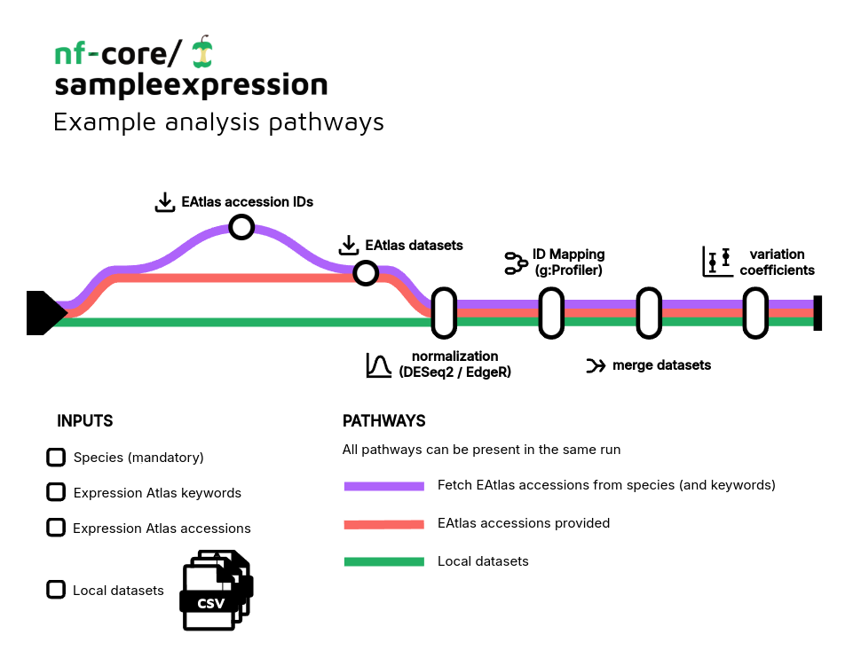

<h1>
  <picture>
    <source media="(prefers-color-scheme: dark)" srcset="docs/images/nf-core-stableexpression_logo_dark.png">
    
  </picture>
</h1>

[](https://github.com/codespaces/new/nf-core/stableexpression)
[](https://github.com/nf-core/stableexpression/actions/workflows/nf-test.yml)
[](https://github.com/nf-core/stableexpression/actions/workflows/linting.yml)[](https://nf-co.re/stableexpression/results)[](https://doi.org/10.5281/zenodo.XXXXXXX)
[](https://www.nf-test.com)

[](https://www.nextflow.io/)
[](https://github.com/nf-core/tools/releases/tag/3.4.1)
[](https://apptainer.org/)
[](https://www.docker.com/)
[](https://docs.conda.io/en/latest/)
[](https://sylabs.io/docs/)
[](https://cloud.seqera.io/launch?pipeline=https://github.com/nf-core/stableexpression)

[](https://nfcore.slack.com/channels/stableexpression)[](https://bsky.app/profile/nf-co.re)[](https://mstdn.science/@nf_core)[](https://www.youtube.com/c/nf-core)

## Introduction

**nf-core/stableexpression** is a bioinformatics pipeline aiming to aggregate multiple count datasets (public / provided by the user) for a specific species and find the most stable genes.

It takes as main inputs :
  * a species name (mandatory)
  * keywords for Expression Atlas / GEO search (optional)
  * a CSV input file listing your own raw / normalised count datasets (optional).

**Use cases**:
  * **find the most suitable genes as RT-qPCR reference genes for a specific species (and optionally specific conditions)**
  * download all Expression Atlas and NCBI GEO datasets (microarray only!) for a species


<p align="center">
    
</p>

## Basic usage

> [!NOTE]
> If you are new to Nextflow and nf-core, please refer to [this page](https://nf-co.re/docs/usage/installation) on how to set-up Nextflow. Make sure to [test your setup](https://nf-co.re/docs/usage/introduction#how-to-run-a-pipeline) with `-profile test` before running the workflow on actual data.

To search the most stable genes in a species considering all public datasets, simply run:

```bash
nextflow run nf-core/stableexpression \
   -r dev \
   -profile <PROFILE (examples: docker / apptainer / conda / micromamba)> \
   --species <SPECIES (examples: arabidopsis_thaliana / "drosophila melanogaster")> \
   --outdir <OUTDIR (example: ./results)>
 ```

> [!IMPORTANT]
 > For more specific scenarios, __like fetching only specific conditions or using your own expression dataset(s)__, please refer to the [usage documentation](https://nf-co.re/stableexpression/usage).

> [!NOTE]
> See [here](https://nf-co.re/stableexpression/usage#profiles) for more information about profiles.

## Pipeline output

To see the results of an example test run with a full size dataset refer to the [results](https://nf-co.re/stableexpression/results) tab on the nf-core website pipeline page.
For more details about the output files and reports, please refer to the
[output documentation](https://nf-co.re/stableexpression/output).

## Support us

If you like nf-core/stableexpression, please make sure you give it a star on GitHub.

[](https://github.com/nf-core/stableexpression)

## Credits

nf-core/stableexpression was originally written by Olivier Coen.

<!-- We thank the following people for their extensive assistance in the development of this pipeline: -->

<!-- TODO nf-core: If applicable, make list of people who have also contributed -->

## Contributions and Support

If you would like to contribute to this pipeline, please see the [contributing guidelines](.github/CONTRIBUTING.md).

For further information or help, don't hesitate to get in touch on the [Slack `#stableexpression` channel](https://nfcore.slack.com/channels/stableexpression) (you can join with [this invite](https://nf-co.re/join/slack)).

## Citations

<!-- TODO nf-core: Add citation for pipeline after first release. Uncomment lines below and update Zenodo doi and badge at the top of this file. -->
<!-- If you use nf-core/stableexpression for your analysis, please cite it using the following doi: [10.5281/zenodo.XXXXXX](https://doi.org/10.5281/zenodo.XXXXXX) -->

<!-- TODO nf-core: Add bibliography of tools and data used in your pipeline -->

An extensive list of references for the tools used by the pipeline can be found in the [`CITATIONS.md`](CITATIONS.md) file.

You can cite the `nf-core` publication as follows:

> **The nf-core framework for community-curated bioinformatics pipelines.**
>
> Philip Ewels, Alexander Peltzer, Sven Fillinger, Harshil Patel, Johannes Alneberg, Andreas Wilm, Maxime Ulysse Garcia, Paolo Di Tommaso & Sven Nahnsen.
>
> _Nat Biotechnol._ 2020 Feb 13. doi: [10.1038/s41587-020-0439-x](https://dx.doi.org/10.1038/s41587-020-0439-x).
