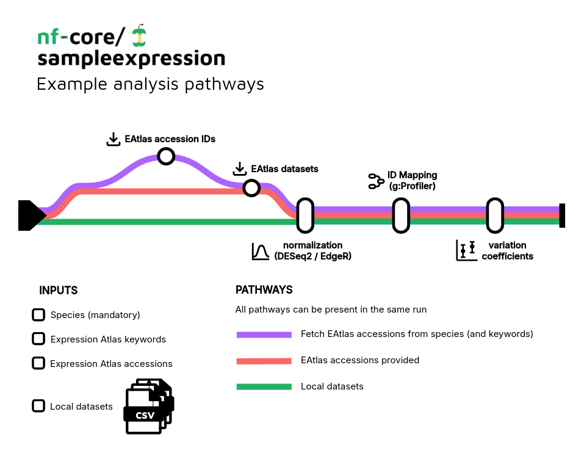

<h1>
  <picture>
    <source media="(prefers-color-scheme: dark)" srcset="docs/images/nf-core-stableexpression_logo_dark.png">
    
  </picture>
</h1>

[](https://github.com/nf-core/stableexpression/actions/workflows/ci.yml)
[](https://github.com/nf-core/stableexpression/actions/workflows/linting.yml)[](https://nf-co.re/stableexpression/results)
[](https://www.nf-test.com)

[](https://www.nextflow.io/)
[](https://docs.conda.io/en/latest/)
[](https://www.docker.com/)
[](https://sylabs.io/docs/)
[](https://cloud.seqera.io/launch?pipeline=https://github.com/nf-core/stableexpression)

[](https://nfcore.slack.com/channels/stableexpression)[](https://twitter.com/nf_core)[](https://mstdn.science/@nf_core)[](https://www.youtube.com/c/nf-core)

## Introduction

**nf-core/stableexpression** is a bioinformatics pipeline that aims at finding the most stable genes among a single or multiple public / local count datasets. It takes as input a species name (mandatory), keywords for expression atlas search (optional) and / or a CSV input file listing local raw / normalized count datasets (optional). **A typical usage is to find the most suitable qPCR housekeeping genes for a specific species (and optionally specific conditions)**.

<p align="center">
    
</p>

## Pipeline summary

1. Get Expression Atlas accessions corresponding to the provided species (and optionally keywords) ([Expression Atlas](https://www.ebi.ac.uk/gxa/home); optional)
2. Download Expression Atlas data ([Expression Atlas](https://www.ebi.ac.uk/gxa/home); optional)
3. Normalize raw data (using [DESeq2](https://bioconductor.org/packages/release/bioc/html/DESeq2.html) or [EdgeR](https://bioconductor.org/packages/release/bioc/html/edgeR.html))
4. Map gene IDS to Ensembl IDS for standardisation among datasets ([g:Profiler](https://biit.cs.ut.ee/gprofiler/gost))
5. Compute gene variation coefficients and get the most stable genes

## Usage

> [!NOTE]
> If you are new to Nextflow and nf-core, please refer to [this page](https://nf-co.re/docs/usage/installation) on how to set-up Nextflow. Make sure to [test your setup](https://nf-co.re/docs/usage/introduction#how-to-run-a-pipeline) with `-profile test` before running the workflow on actual data.

First, prepare a samplesheet listing the different count datasets:

`datasets.csv`:

```csv
counts,design,normalized
path/to/normalized.counts.csv,path/to/normalized.design.csv,true
path/to/raw.counts.csv,path/to/raw.design.csv,false
```

Make sure to format your datasets properly:

`counts.csv`:

```csv
,sample_A,sample_B,sample_C
gene_1,1,2,3
gene_2,1,2,3
...
```

`design.csv`:

```csv
sample,condition
sample_A,condition_1
sample_B,condition_2
...
```

Now you can tun the pipeline as follows:

> ```bash
> nextflow run nf-core/stableexpression \
>   -profile docker \
>   --species <SPECIES> \
>   --eatlas_accessions <ACCESSIONS> \
>   --eatlas_keywords <KEYWORDS> \
>   --datasets ./datasets.csv \
>   --outdir ./results
> ```

> [!WARNING]
> Please provide pipeline parameters via the CLI or Nextflow `-params-file` option. Custom config files including those provided by the `-c` Nextflow option can be used to provide any configuration _**except for parameters**_;
> see [docs](https://nf-co.re/usage/configuration#custom-configuration-files).

For more details and further functionality, please refer to the [usage documentation](https://nf-co.re/stableexpression/usage) and the [parameter documentation](https://nf-co.re/stableexpression/parameters).

## Pipeline output

To see the results of an example test run with a full size dataset refer to the [results](https://nf-co.re/stableexpression/results) tab on the nf-core website pipeline page.
For more details about the output files and reports, please refer to the
[output documentation](https://nf-co.re/stableexpression/output).

## Credits

nf-core/stableexpression was originally written by Olivier Coen.

## Contributions and Support

If you would like to contribute to this pipeline, please see the [contributing guidelines](.github/CONTRIBUTING.md).

For further information or help, don't hesitate to get in touch on the [Slack `#stableexpression` channel](https://nfcore.slack.com/channels/stableexpression) (you can join with [this invite](https://nf-co.re/join/slack)).

## Citations

An extensive list of references for the tools used by the pipeline can be found in the [`CITATIONS.md`](CITATIONS.md) file.

You can cite the `nf-core` publication as follows:

> **The nf-core framework for community-curated bioinformatics pipelines.**
>
> Philip Ewels, Alexander Peltzer, Sven Fillinger, Harshil Patel, Johannes Alneberg, Andreas Wilm, Maxime Ulysse Garcia, Paolo Di Tommaso & Sven Nahnsen.
>
> _Nat Biotechnol._ 2020 Feb 13. doi: [10.1038/s41587-020-0439-x](https://dx.doi.org/10.1038/s41587-020-0439-x).
