# nf-core/stableexpression: Output

## Pipeline reports (TLDR)

The main output of the pipeline is the MultiQC report, which summarises results at the end of the pipeline. This report is located at `<OUTDIR>/reporting/multiqc_report.html` and can be opened in your favorite browser.

For advanced users who seek to explore more deeply the distributions of normalised counts gene per gene or sample per sample, a Dash Plotly app is readily prepared at the end of each pipeline run. See [here](#dash-plotly-app) for explanation on how to run the app.

## Introduction

This document describes the output produced by the pipeline, **relatively to the top-level results directory (defined by the `--outdir` parameter)**.

The directories listed below will be created in the results directory after the pipeline has finished.

## Main output files  

### MultiQC

This report is located at `reporting/multiqc_report.html` and can be opened in a browser.

[MultiQC](http://multiqc.info) is a visualization tool that generates a single HTML report summarising all samples in your project. The pipeline has special steps which also allow the software versions to be reported in the MultiQC output for future traceability. For more information about how to use MultiQC reports, see <http://multiqc.info>.

You can view the MultiQC report by opening `multiqc_report.html` in your browser.

>[!NOTE]
>Genes are divided into sections based on their mean normalised expression level. Genes in Section 1 are the most highly expressed genes while genes in last section are the least highly expressed. Users can modify the number of section (and hence the granularity of the analysis) by setting the `--nb_sections` parameter.

>[!WARNING]
>Be careful when setting the `--nb_sections` parameter. A value over `20` may result in a very large `multiqc_report.html`, which could be difficult to open in a browser.

<details markdown="1">
<summary>Report content</summary>

#### Gene tables

For each section of genes, a table is displayed with the gene names and their statistics (including their rank, stability score).

<p align="center">
    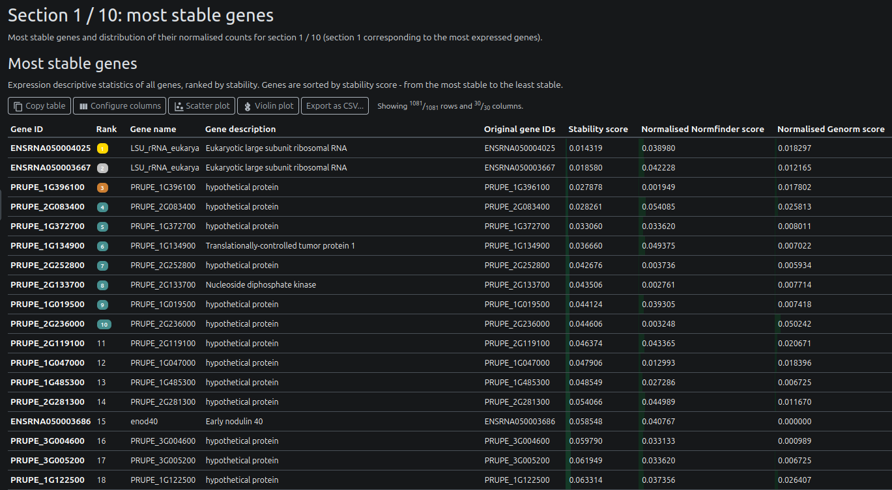
</p>

#### Gene normalised expression

For each section, the normalised expression values are displayed of the top 25 genes are displayed as boxplots.

<p align="center">
    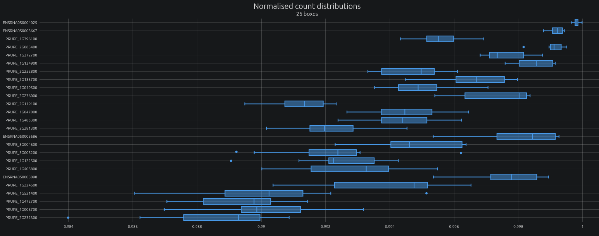
</p>

#### Dataset statistics

Various statistics about the analysed datasets are displayed, including the number of genes, the mean and standard deviation of the normalised expression values.

Skewness of normalised expression values:

<p align="center">
    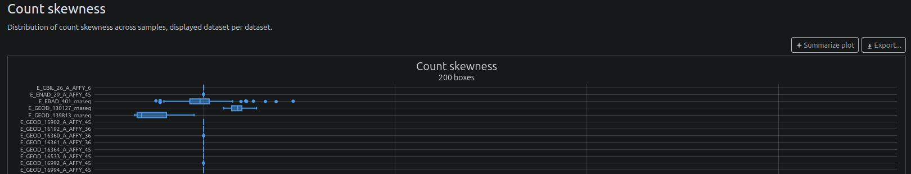
</p>

Proportion of zero values:

<p align="center">
    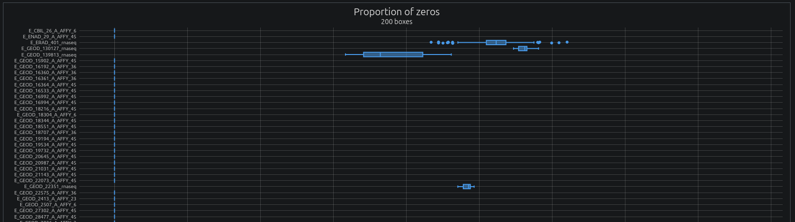
</p>

Proportion of missing values (genes not present but present in other samples):

<p align="center">
    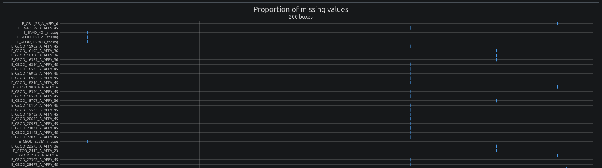
</p>

#### Dataset filtering

For each dataset, samples displaying a too high proportion of zero values or missing values are filtered out. The filtered datasets are then used for further analysis. The report displays the proportion of samples filtered out for each dataset. Users can modify the filtering thresholds using the `--max_zero_ratio` and `--max_null_ratio` parameters respectively.

Proportions of samples filtered out based on zero values:

<p align="center">
    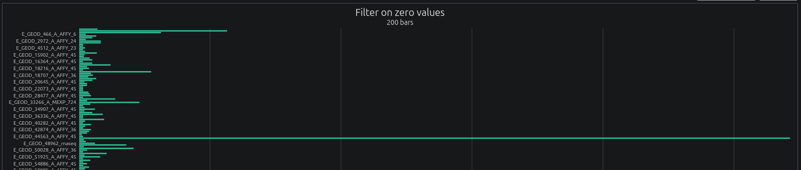
</p>

Proportions of samples filtered out based on missing values:

<p align="center">
    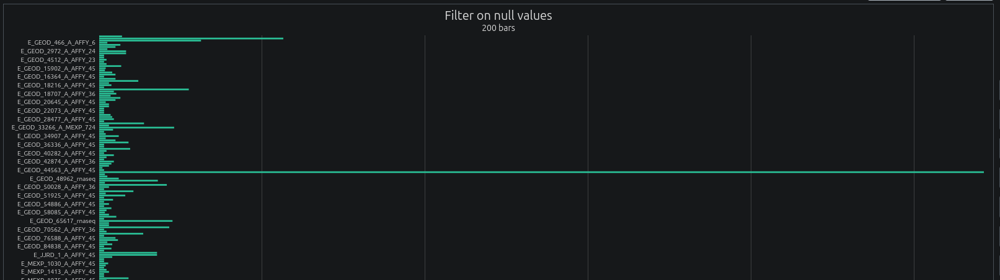
</p>

#### Gene ID mapping

The pipeline maps gene IDs to their corresponding gene names using the Ensembl database.

Distribution of gene occurrences:

<p align="center">
    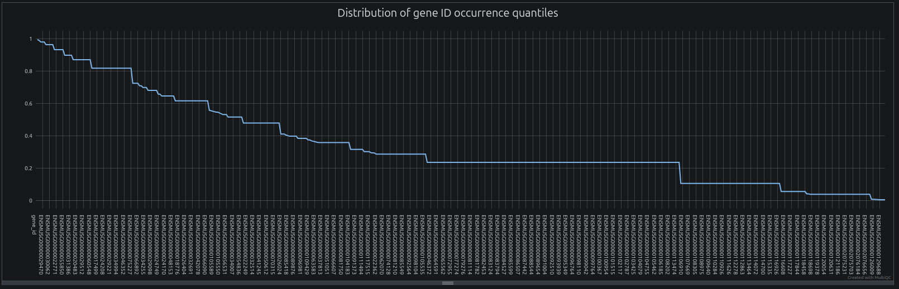
</p>

**NB:** The pipeline filters out genes based on gene ID occurrence using two parameters: `--min_occurrence_freq` and `--min_occurrence_quantile`. The first parameter filters out genes showing a too low frequency of occurrence, while the second parameter filters genes belonging to the last quantiles of occurrence. Users can tweak these parameters to increase or decrease the filtering stringency. The distribution of gene occurrences displayed in the MultiqcQC report can be very useful to detect a plateau of gene ID occurrence frequency, which can indicate the presence of rare gene IDs. In the distribution above, a plateau is reached around `0.236`. In such case, setting `--min_occurrence_freq 0.24` (default: `0.2`) will remove all gene IDs with an occurrence frequency below this plateau.

Gene ID mapping statistics:

<p align="center">
    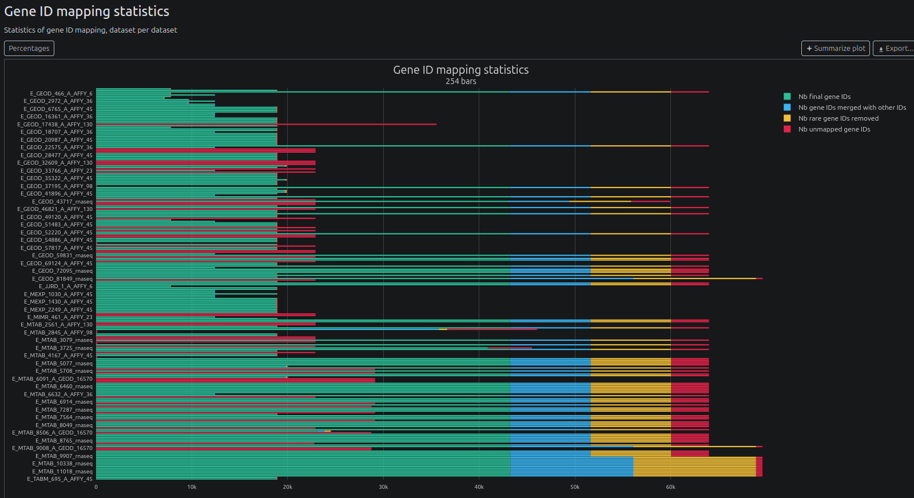
</p>

Reasons of failures of gene ID mapping:

<p align="center">
    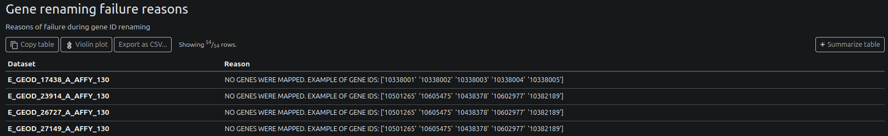
</p>

Reasons of incomplete gene ID mapping:

<p align="center">
    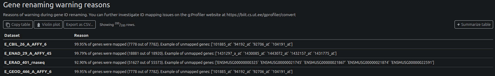
</p>

#### Downloaded datasets

The report shows metadata about the downloaded datasets:
- Expression Atlas
- optionally: GEO datasets (when `--fetch_geo_accessions` was set)

The report also has a section for datasets that could not be downloaded, and the reasons for failure.

Example for Expression Atlas:

<p align="center">
    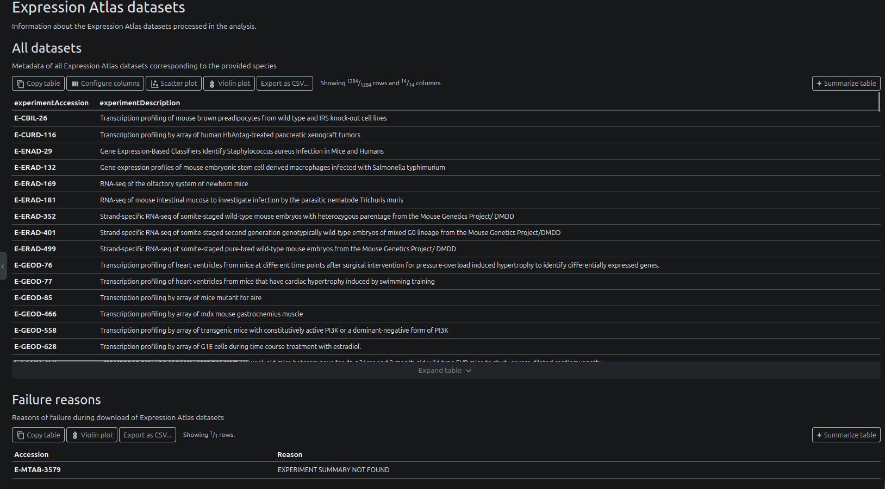
</p>

#### Software version

You can access versions of all softwares used in the pipeline, step by step:


<p align="center">
    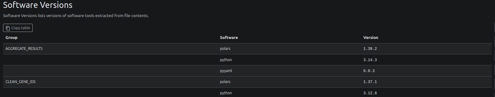
</p>


</details>


### Dash Plotly app

`reporting/dash_app/`: folder containing the Dash Plotly app.

Dash Plotly is a web-based interactive visualization library that allows you to create interactive plots and dashboards.

<details markdown="1">
<summary>Launch application</summary>

To launch the app, you must first create and activate the appropriate conda environment:

```bash
conda env create -n dash_app -f reporting/dash_app/environment.yml
conda activate dash_app
```

then:

```
cd reporting/dash_app
python app.py
```

and open your browser at `http://localhost:8080`

> [!NOTE]
> The app will try to use the port `8080` by default. If it is already in use, it will try `8081`, `8082` and so on. Check the logs to see which port it is using.

</details>

<details markdown="1">
<summary>Use the app</summary>

#### Overview

The application contains 3 tabs:
- a first tab showing the distribution of expressions for selected genes, accross of all samples that passed filtering
- a second tab showing the distribution of all gene expressions in selected samples (only for samples that passed filtering)
- a third tab showing scoring / statistics for all genes

The header allows navigating between the tabs. Click on a specific tab to switch to it. The `Select data / options` button allows selecting the dataset to display, together with other options.

<p align="left">
    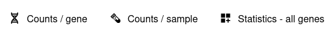
</p>

#### Distribution of gene expressions (`Counts / gene`)

Users can visualise the distribution of expressions of specific genes.

<p align="center">
    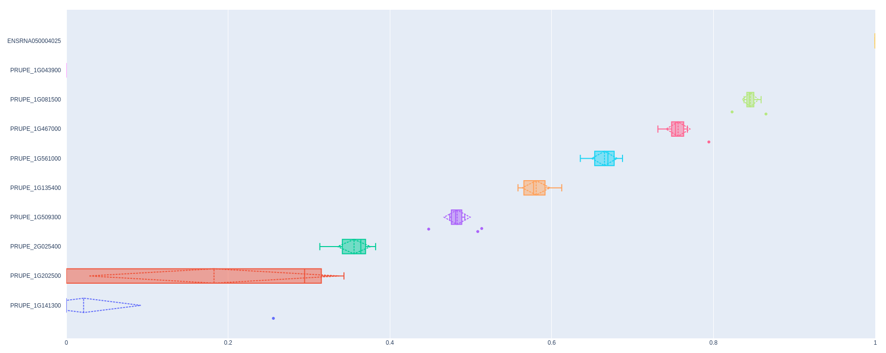
</p>

To select a gene, just start typing its name and click on it when it appears.

<p align="left">
    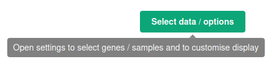
</p>

<p align="left">
    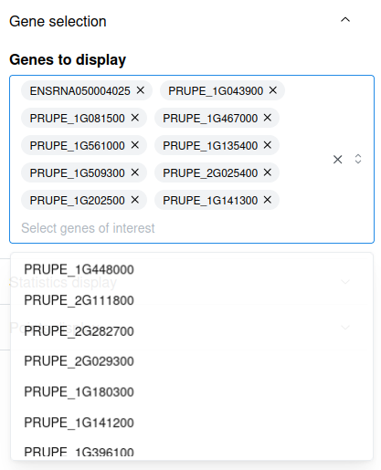
</p>

#### Distribution of all gene expressions in specific samples (`Counts / sample`)

You can visualise the distribution of expressions of all genes in specific samples. Likewise, to select a sample, you may type its name and click on it when it appears.

<p align="center">
    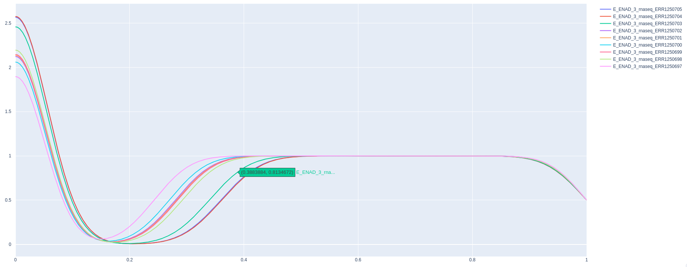
</p>

#### Gene scoring / statistics (`Statistics - all genes`)

Scores and statistics for each gene are displayed here.

<p align="center">
    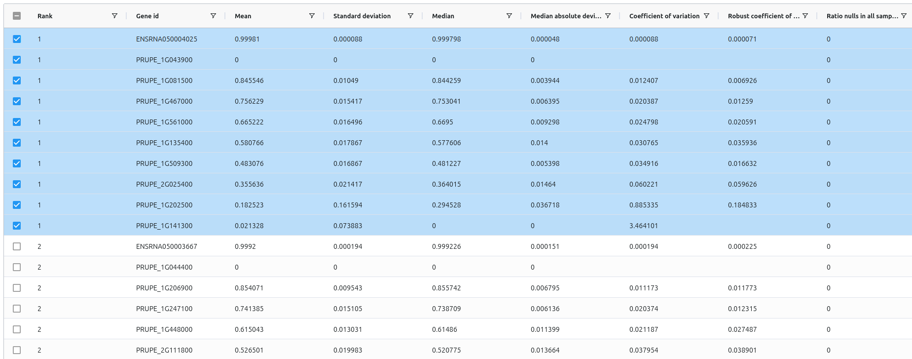
</p>

**NB:** Users can select a gene directly in the table by ticking the checkbox next to the gene name. This will add the gene to the list of selected genes in the `Counts / gene` tab.


</details>

### Gene statistics and scores

The pipelines also exports a summary of all genes, located at `reporting/all_genes_summary.csv`. It contains their statistics, scores, ranks and respective sections.


### Merged data

Parquet files containing all normalised gene counts are also stored in the `merged_data/` directory.

<details markdown="1">
<summary>Merged data</summary>

- `merged_data/all_counts.imputed.parquet`: parquet file containing all normalised + imputed gene counts
- `merged_data/all_counts.parquet`: parquet file containing all normalised gene counts
- `merged_data/whole_design.csv`: table containing designs for all datasets and all samples comprised in the analysis

</details>


## Other output files of interest (useful for debbuging)

### Individual datasets

All individual datasets are also stored at each step of the pipeline, with the following pattern:
`datasets/<platform>/<normalisation status>/<dataset name>/`

<details markdown="1">
<summary>Sub sections</summary>

- `0.downloaded/`: raw datasets downloaded from public databases
- `1.id_filtered_renamed/`: datasets with filtered and renamed gene IDs
- `2.samples_filtered/`: datasets with filtered samples
- `3.`: `TPM` / `CPM` normalisation
  - `3.tpm_normalised/`: `TPM` normalised datasets
  - `3.cpm_normalised/`: `CPM` normalised datasets
- `4.quantile_normalised/`: quantile normalised datasets

</details>

The design of each dataset is also stored in its own directory.

### Expression Atlas / GEO accessions

<details markdown="1">
<summary>Accession files</summary>

- `accessions/expression_atlas/`: accessions found when querying Expression Atlas
- `accessions/geo/`: accessions found when querying GEO

</details>

### ID Mapping

The pipeline also exports the ID mapping metadata used for gene ID conversion.

<details markdown="1">
<summary>ID mapping metadata</summary>

- `idmapping/global_gene_metadata.csv`: table containing the complete set of gene metadata, obtained either via gProfiler or via the custom file provided by the user
- `idmapping/global_gene_id_mapping.csv`: table containing the complete set of gene id mapping, obtained either via gProfiler or via the custom file
- `idmapping/valid_gene_ids.txt`: List of gene IDs retained as valid

</details>

### Annotation / gene length

The annotation and gene lengths are also stored in the `annotation/` directory.

<details markdown="1">
<summary>Files</summary>

- `gene_transcript_lengths.csv`: transcript length relative to each gene ID
- `<annotation name>.gff3.gz`: GFF3 file

</details>

### Pipeline information

<details markdown="1">
<summary>Output files</summary>

- `pipeline_info/`
  - Reports generated by Nextflow: `execution_report.html`, `execution_timeline.html`, `execution_trace.txt` and `pipeline_dag.dot`/`pipeline_dag.svg`.
  - Reports generated by the pipeline: `pipeline_report.html`, `pipeline_report.txt` and `software_versions.yml`. The `pipeline_report*` files will only be present if the `--email` / `--email_on_fail` parameter's are used when running the pipeline.
  - Parameters used by the pipeline run: `params.json`.

</details>

[Nextflow](https://www.nextflow.io/docs/latest/tracing.html) provides excellent functionality for generating various reports relevant to the running and execution of the pipeline. This will allow you to troubleshoot errors with the running of the pipeline, and also provide you with other information such as launch commands, run times and resource usage.
